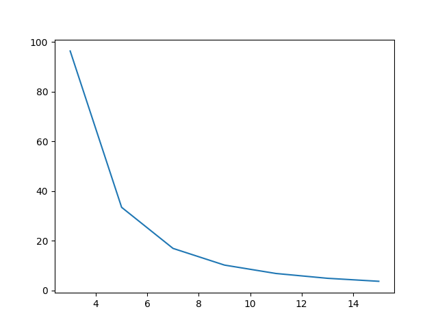

# Assignment 4: Performance Modeling: 2D Convolution

## Modelling

- **How many Flops needs to be done to compute a convolution of dimension k on a image of size n × m?**

Assuming the edge pixels are ignored, the dimensions of the output image would be (`n - k + 1`) x (`m - k + 1`). Meaning that we'd have to calculate the values for `(n - k + 1) * (m - k + 1)` pixels; which implies that we'd need to perform `(n - k + 1) * (m - k + 1)` convolutions.

The amount of flops needed for one convolution is `k * k` multiplications and `k * k - 1` additions, coming to `(2 * k * k) - 1` flops.

Thusly, the total amount of floating point operations needed are `((2 * k * k) - 1) * (n - k + 1) * (m - k + 1)`.

- **How much memory needs to be moved to compute a convolution of dimension k on a image of size n × m?**

As calculated above, we need to perform `(n - k + 1) * (m - k + 1)` convolutions. For each, convolution we'll need to move `k * k` floating point numbers for the kernel, and `k * k` pixels from the image.

Total memory moved would be `(2 * k * k) * (n - k + 1) * (m - k + 1) * 32` bits.

- **Assuming the performance numbers you measured in assignment 1 and 2, how long should computing a convolution of dimension 3 on an image of 1024 × 768 take?**

According to what we found in question 1 it would take `13,308,484` flops or `0.013308484` GFlops to get to the final output image. According to my previous estimations a compute node on mamba should have a peak performance of `1638.4` GFlops/sec.

It should thusly take `0.013308484 ÷ 1638.4` seconds which comes to `8.12285400390625e-6` seconds or `8.12285` microseconds.

- **What about a convolution of dimension 11 ? On this kind of problem, performance is usually reported in pixel processed per second.**

For a `1024 x 768` image, a kernel of dimension `11` would take `185,235,492‬‬` flops. Which would take `1.130587719726563e-4‬` seconds.

Since in all we processed and produced `1014 x 758` output pixels,we produced `6,798,340,248.962656‬` pixels per second, or `6.7983` gigapixels/sec.

- **Plot maximum expected performance as a function of k.**

Y-axis is pixels processed in gigapixels per second, and X-axis is the kernel size.